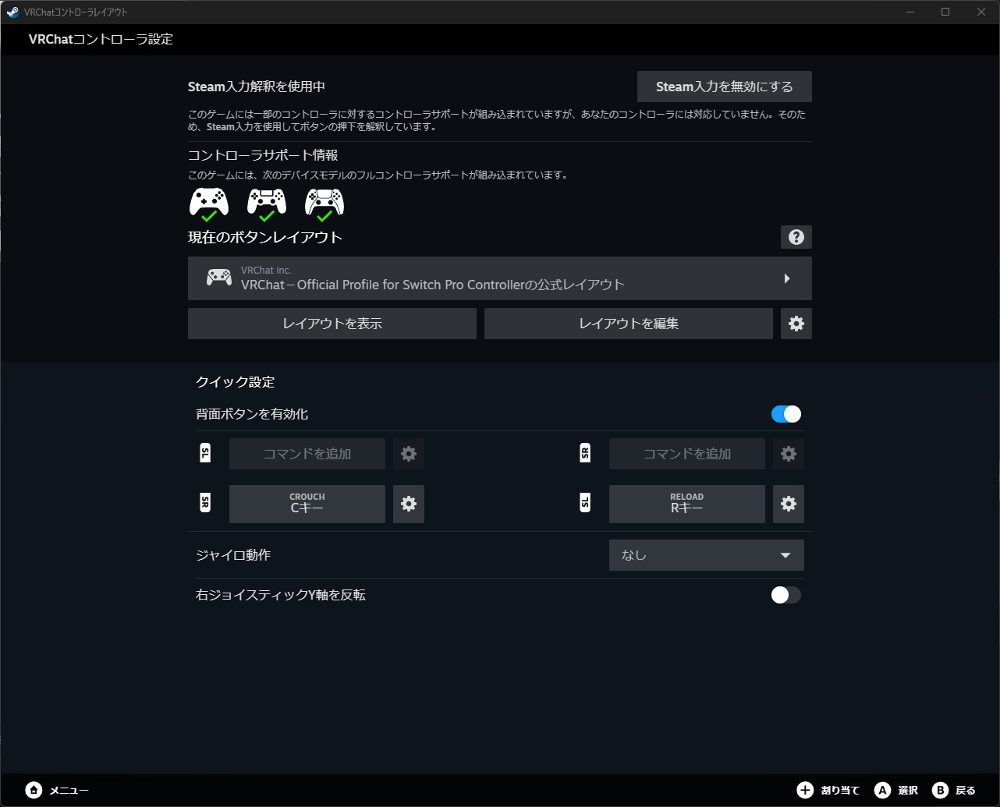

# JoyToVRC 

VRChatをJoy-Conでデスクトップモードで遊ぶとき Joy-Con のIMUの情報で手を動かばいいのでは？と思い作りました。 
すごく動くわけじゃないのでちょっとでも手が動いた方が嬉しい人向け。

仕組みとしては、SteamがJoy-Conの情報握っていますが、裏で別のソフトを動かしても同時に情報取れることを利用しOSCでアバターExParamに情報送信・アニメーションで動作です。

[バイナリは boothで配布しています。](https://booth.pm/ja/items/6080890)
(githubのほうが新しい場合があります)

## まず Joy-ConをVRChat デスクトップモードで(JoyToVRCなしで)使えるようにする
### ①VRChatをJoyCon で操作するために、まずPCに接続します。
　説明：[https://github.com/tbbsakura/VBTTools/blob/main/docs/JoyconConnect.md](https://github.com/tbbsakura/VBTTools/blob/main/docs/JoyconConnect.md)

### ②VRC起動してから、Steamの画面で入力の設定をします 
Setting0.jpg   の1番のところのメニューから設定、コントローラーと進み次の画像のように設定します。 
Setting1.jpg    

さらにSetting0.jpg の2番のところのコントローラーアイコンをクリックします。 
Steam入力を有効にしてない場合は空白の多い画面に有効にするボタンがあるので有効にします。

現在のボタンのレイアウト、というところで VRChat-Official Profile for Switch Pro Controller の 公式レイアウト、を選びます。（右の▶入って推奨の中の一番下）
下のほうは背面ボタンを有効化して、右SLにRキーを割り当てます（パイメニュー出す用）
Rに設定するのは、コマンドを追加を押して上のほうのキーボードを選びRを選びます。

　

設定後は  Setting2.jpg    のようになります。
（開いてるところに機能追加してもかまいません。Shift+FNキーで一発表情ボタンとかにもできるはず）

下のほうのゲーム以外のコントローラーのレイアウトの「デスクトップレイアウト」を設定してあると、ゲーム以外のアプリウィンドウが前面にきているときに操作ができます。例えばマウス操作のようなことができます。便利だなと思う方は設定を、とりあえず混乱を避けたい方は無効にしておくといいでしょう。 
「ガイドボタンコード設定」は、ガイドボタンと一緒に押すと、特定のアクションを実行する一連の入力で、HOMEボタンを押しながらスティック操作でマウスのような動作をさせたりできます。HOMEボタン押しながら何かをしなければ影響しないので、そのままで良いでしょう。

　

これでVRChatで遊べることを確認しておいてください。（把握できたら慣れたら十字キーやABXYの動作をカスタマイズすると便利です）

　

## JoyToVRC で 手を動かす方法
### ③アバターは TMARelay で手を動かせるアバターにしておきます。
  TMARelay はこちら [https://booth.pm/ja/items/5056237](https://booth.pm/ja/items/5056237)  
TMARelay_v0.3.0MA.ZIP (v0.2.1以降ならoK)を使います。

ModularAvatar があれば、TMARelay_MA_Both の prefab をアバター直下に入れるだけです。
詳しい説明はこちら [https://tbbsakura.fc2.net/blog-entry-19.html](https://tbbsakura.fc2.net/blog-entry-19.html) 

VRChat で当該アバターを呼び出したら、一度、パイメニュー（さきほどの右SLで出せます）を出して、右スティックとトリガーで、上のOptionに入り、さらに、OSCを選びます。Enabledを有効にしたあと、同じところの左 Reset Configをしておきます。

### ④JoyToVRCを起動して、Joy-Con Startを押し、しばし待ちます。
赤と青の直方体が出てきたら、スティックで動かしてみます。 
直方体が動かない場合はアプリ終了してやりなおしてください。 
動いたらSendOSCにチェックを入れればアバターの手が動きます。 
標準操作(移動等)はVRCのウィンドウを選択してないとできないので、VRCのウィンドウを選択しておきます。 

### ⑤キャリブレーション
コントローラーと直方体の向きがあってないときは、水平に持ち（右手なら、プラスが自分から遠い側の上面にあり、自分向きに赤外線の枠がある状態）で、右手ならYボタン、左手なら十字キーの左◀を使うと位置調整されます。片手ずつ実施できます。 
キャリブレーションボタンを押している間、直方体が黄色になります。 
キャリブレーションのボタンを変更したいときは画面の Caliblation Button で指定できます。

### ⑥その他
IPアドレス、ポートは通常変更しないと思いますが、他のPCに送りたい場合等に修正できます。
指定が変な時(IPアドレスが8bit x 4 の範囲内にない、ポートが65536以上等)の場合はSend OSCのチェックが効かず、該当箇所が赤くなります。
IPアドレス、ポート、キャリブレーションボタンの設定はファイル(JoyToVRC.setting.json)に保存され、次回起動時に同じ内容になります。

## ライセンス情報
MIT License.  
Copyright (c) 2024 Sakura(さくら) / tbbsakura 

    Permission is hereby granted, free of charge, to any person obtaining a copy
    of this software and associated documentation files (the "Software"), to deal
    in the Software without restriction, including without limitation the rights
    to use, copy, modify, merge, publish, distribute, sublicense, and/or sell
    copies of the Software, and to permit persons to whom the Software is
    furnished to do so, subject to the following conditions:

    The above copyright notice and this permission notice shall be included in all
    copies or substantial portions of the Software.

    THE SOFTWARE IS PROVIDED "AS IS", WITHOUT WARRANTY OF ANY KIND, EXPRESS OR
    IMPLIED, INCLUDING BUT NOT LIMITED TO THE WARRANTIES OF MERCHANTABILITY,
    FITNESS FOR A PARTICULAR PURPOSE AND NONINFRINGEMENT. IN NO EVENT SHALL THE
    AUTHORS OR COPYRIGHT HOLDERS BE LIABLE FOR ANY CLAIM, DAMAGES OR OTHER
    LIABILITY, WHETHER IN AN ACTION OF CONTRACT, TORT OR OTHERWISE, ARISING FROM,
    OUT OF OR IN CONNECTION WITH THE SOFTWARE OR THE USE OR OTHER DEALINGS IN THE
    SOFTWARE.

以下のMITライセンスのソフトを一部改変して使っています

- [uOSC](https://github.com/hecomi/uOSC) [ライセンス情報](https://github.com/hecomi/uOSC/blob/master/LICENSE.md)
- [Joyconlib](https://github.com/Looking-Glass/JoyconLib) [ライセンス情報](https://github.com/Looking-Glass/JoyconLib/blob/master/LICENSE)

## Build
当リポジトリのファイルを git clone した後に、uOSC は前述のサイトの unitypackage を入れてください。 
(Joyconlibは改変してあるのが入ってるので、入れない（上書きしない）でください。)
 
あとは シーン Assets/SakuraShop_tbb/JoyToVRC/JoyToVRC を開いて Build します。
